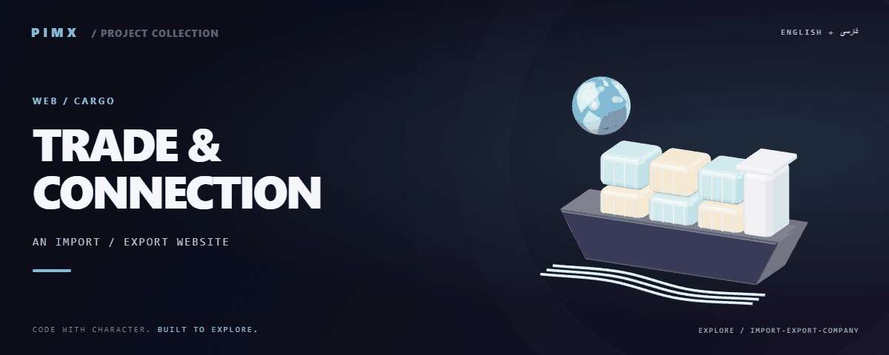

<div align="center">



**[English](README.md) · [فارسی](README.fa.md)**

</div>

# 🚢 TRADE & CONNECTION

A multi-page corporate website for an import/export company, implemented with HTML, CSS and JavaScript. The local source folder is `Mr.Amirhosseini`.

[GitHub](https://github.com/MOHAMMADREZAABEDINPOOR/Import-Export-Company) · [PIMX / Profile](https://github.com/MOHAMMADREZAABEDINPOOR) · [Static artwork](assets/readme/hero.png)

| At a glance | Details |
|:---|:---|
| 🚢 Experience | Web application / browser experience |
| 🧰 Built with | `HTML / CSS / JavaScript` |
| 🌐 Documentation | [English](README.md) · [فارسی](README.fa.md) |

[✨ Features](#features) · [🚀 Getting started](#getting-started) · [⚙️ Configuration](#configuration) · [🌍 Deployment](#deployment)

---

<a id="features"></a>

## ✨ Features

| Area | Included capability |
|:---|:---|
| 🛍️ Commerce | Home, about, products, services and contact pages |
| ⚡ Workflow | Separate styles and scripts for individual pages |
| 🌐 Experience | Persian text and right-to-left presentation |
| 🎨 Visuals | Animated navigation and responsive visual sections |

<a id="stack"></a>

## 🧰 Stack

| Tool | Version / source |
|---|---|
| HTML / CSS / JavaScript | `static files` |

<a id="getting-started"></a>

## 🚀 Getting started

A modern browser; Python is optional for the local HTTP server.

```bash
git clone https://github.com/MOHAMMADREZAABEDINPOOR/Import-Export-Company.git
cd Import-Export-Company

python -m http.server 8000
```

<a id="configuration"></a>

## ⚙️ Configuration

No standard environment template is defined. Standalone exercises need no external configuration; inspect any service constants or paths in the source before running.

<a id="usage"></a>

## 🎯 Usage

Open index.html through a local HTTP server and navigate the product/service pages. Update company details and contact destinations before hosting.

<a id="project-structure"></a>

## 🗂️ Project structure

| Path | Role |
|---|---|
| [`assets/`](assets/) | Brand/media/README assets |
| [`about.html`](about.html) | Project entry/configuration file |
| [`contact.html`](contact.html) | Project entry/configuration file |
| [`index.html`](index.html) | Project entry/configuration file |
| [`products.html`](products.html) | Project entry/configuration file |
| [`services.html`](services.html) | Project entry/configuration file |

<a id="commands-and-checks"></a>

## 🧪 Commands and checks

No automated test command is declared in a manifest. Verify behavior through a local example run.

<a id="deployment"></a>

## 🌍 Deployment

Publish the directory to an HTTPS static host and verify file paths and external links.

<a id="limitations"></a>

## 📌 Limitations

A static contact form does not by itself deliver email. Add a form backend if required. Product/company claims and image rights need review by the site owner.

<a id="troubleshooting"></a>

## 🛠️ Troubleshooting

- Missing packages: install dependencies using the project’s package manager.
- API/network failure: check the configured origin, provider and hosting bindings.
- Old assets: rebuild when a build script exists, then clear the browser cache.

<a id="contributing"></a>

## 🤝 Contributing

Create a focused branch, verify the affected behavior and explain the change clearly. Keep private data, build outputs and local databases out of commits.

<a id="license"></a>

## 📄 License

No repository-level license file is included in this snapshot. Public visibility alone does not grant reuse rights; contact the repository owner for terms.

---

Part of **PIMX** · Documentation in English and Persian.

---

<div align="center">

🚢 **TRADE & CONNECTION** · [English](README.md) · [فارسی](README.fa.md)

</div>
